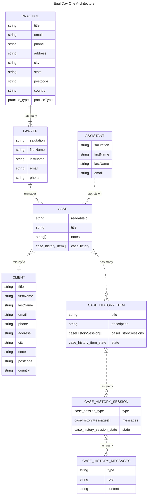

# Day One Architecture

```mermaid
---
title: Egal Day One Architecture
---
    erDiagram
        PRACTICE ||--|{ LAWYER : "has many"
        
        LAWYER ||..o{ CASE : "manages"

        ASSISTANT ||..o{ CASE : "assists on"

        CASE }|..|| CLIENT : "relates to"
        
        CASE }|..o{ CASE_HISTORY_ITEM: "has many"

        CASE_HISTORY_ITEM }|..o{ CASE_HISTORY_SESSION: "has many"

        CASE_HISTORY_SESSION }|..o{ CASE_HISTORY_MESSAGES: "has many"

        PRACTICE {
            string title
            string email
            string phone
            string address
            string city
            string state
            string postcode
            string country
            practice_type pacticeType
        }

        LAWYER {
            string salutation
            string firstName
            string lastName
            string email
            string phone
        }

        ASSISTANT {
            string salutation
            string firstName
            string lastName
            string email
        }
        
        CLIENT {
            string title
            string firstName
            string lastName
            string email
            string phone
            string address
            string city
            string state
            string postcode
            string country
        }
        
        CASE {
            string readableId
            string title
            string[] notes
            case_history_item[] caseHistory
        }
        
        CASE_HISTORY_ITEM {
            string title
            string description
            caseHistorySession[] caseHistorySessions
            case_history_item_state state
        }
        
        CASE_HISTORY_SESSION {
            case_session_type type
            caseHistoryMessages[] messages
            case_history_session_state state
        }

        CASE_HISTORY_MESSAGES {
            string type
            string role
            string content
        }
```
