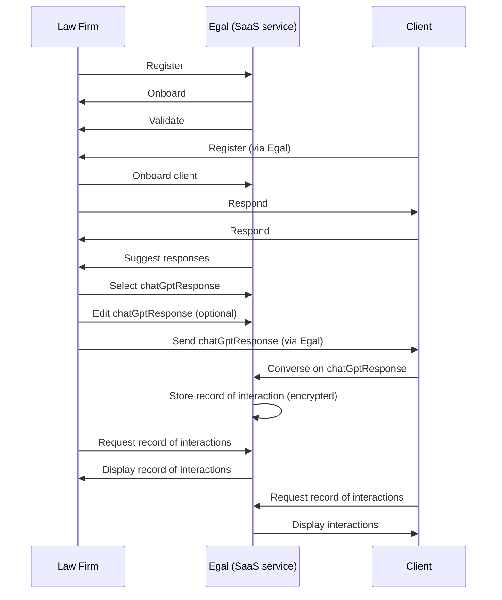

# Legavee - Egal

## Problem statement

Many law firms, including small, medium, and large practices, face challenges managing their workload and staying organised. As a result, they spend less time on client management and customer service, often leading to client frustrations and a poor reputation.

## What we are building

For *Egal*, specifically, we are building **AI assistive software for law firms** to help them **increase productivity, stay organised, and connect with their clients.**

We will deliver the service via **a SaaS model that law firms charge for.** The initial software will be **web-based** and **designed to integrate seamlessly with existing workflow processes**. It will initially act as an **intermediary for client communication** and is designed to take away many mundane communication tasks associated with case management. The software will be tailored to the specific needs of different types of law practice and will be designed to be user-friendly and easily accessible for all employees and clients.

**Scope:** The AI assistive software will include client, financial, and case management features.

**For consideration:** document management

**Out of scope:**  legal research and compliance tracking.

## Why are we building it?

The goal is to make legal representation and case management more equitable and accessible by enabling law firms to provide service at scale at reduced cost.

By implementing AI assistive software, law firms can **streamline their workflow**, **reduce expenses**, and **improve overall efficiency** of their practice as well as **reducing mundane tasks** that need to be undertaken by staff. Additionally, the software will help them to manage client relationships, **reducing the risk of poor reputation** and helping to **provide a better customer service**.

## High level flow, example

